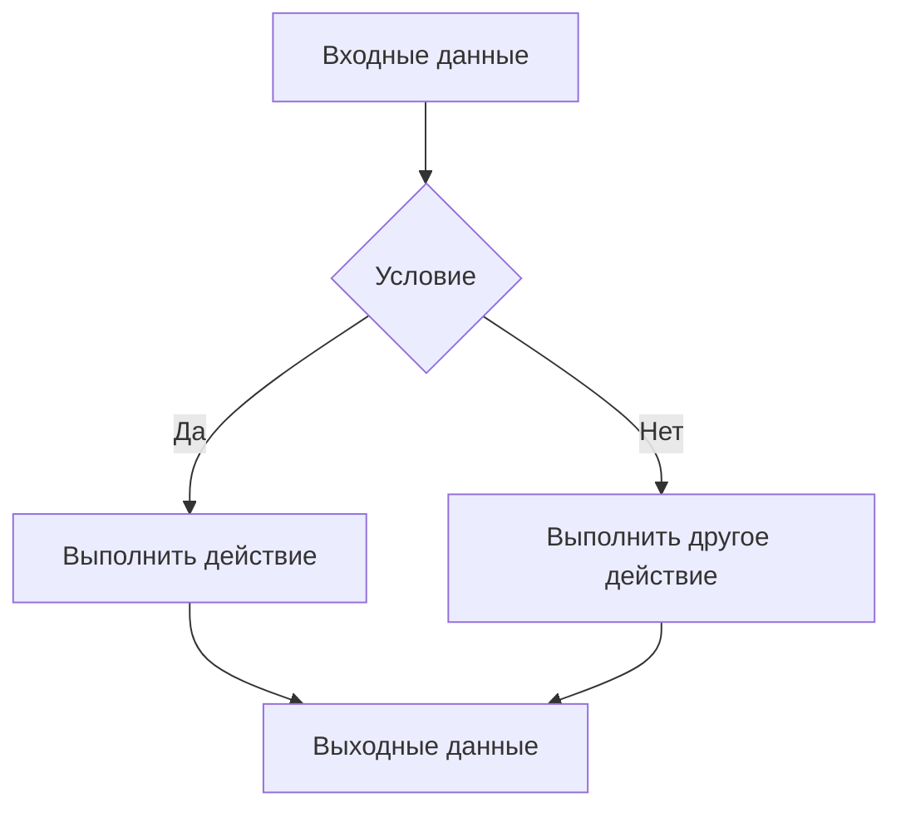

- Загрузка файла из документа формата Н.
- Редактирование введённого текста.
- Удаление комментариев и лишнего всего-всего.
- Количество и нумерация строк.
- Выделение и идентификация лексем. Запись в таблице классов лексем: класс класс класс класс класс.
- Формирование дескрипторного и псевдокода.
- Распознавание лексических ошибок: ошибки в константах, идентификаторах, **незакрытый комментарий** (пушто легко сделать, она советует), и т.д.

**Дополнительные требования:**
- Работа лексического анализатора должна моделироваться конечным автоматом.
- Построить КА распознающий классы лексем: 123456
- Построить регулярную грамматику, соответствующую конечному автомату.
- Построить КС грамматику по фрагменту варианта (Указать вариант)
- Построить порождение и дерево вывода

**Алгоритмы**

Откуда-то нам надо взять и указать. Она перечислила:
- Составить блок-схемы: общий алгоритм программы, все функции.
- Сложность алгоритма
- ...

**Этапы и стадии разработки по лабораторным работам:**

- Дополнительные функции лексического анализатора
- Распознавание  заданных  слов языка программирования
- Построение таблиц идентификаторов
- Построение дескрипторного кода. Построение регулярной грамматики.
- Обработка ошибок на этапе лексического анализа. Построение КС-грамматики.
- **ОФОРМИТЬ РПЗ ПО КУРСОВОЙ РАБОТЕ И СДАТЬ ПРЕПОДАВАТЕЛЮ!!!**

Первая звучит странно, наверное надо что-то иное написать, выписано на случай если она закроет и спрячет названия лаб.

