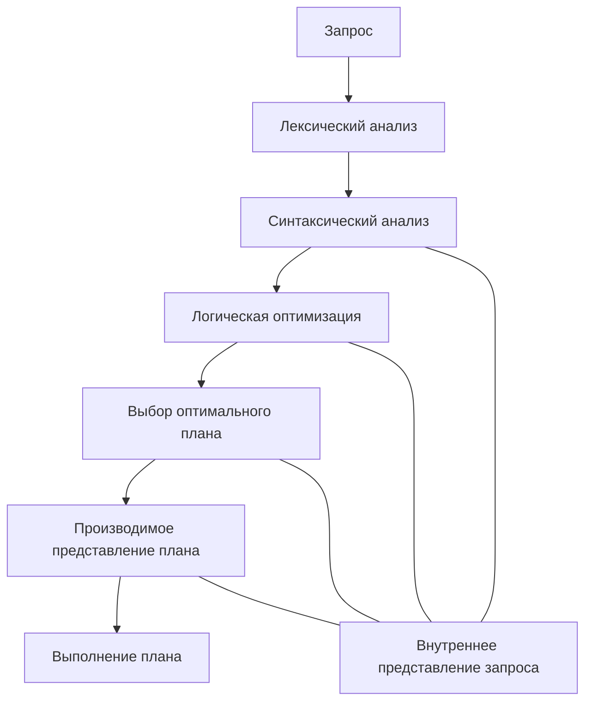

# Компиляторы в SQL. Проблемы оптимизации.

Оптимизация запросов в реляционных СУБД - это такой способ разработки запроса, при котором по его начальному представлению вырабатывается процедурный план выполнения, наиболее оптимальный для управляющих структур.

1. **Лексико-синтаксический анализ**: формирует представление, которое отображает запросы и формирует информацию в БД. Эта информация выбирается из каталога БД.
2. **Логическая оптимизация**: проверяются преобразования, которые могут быть эквивалентными или семантическими (новое представление не является эквивалентом начального, но характерно тем, что результат выполнения совпадает с запросом в начальной форме).
3. **Внутреннее представление** остаётся персистентным выбором осмотренных процедурных планов для каждой оценки стоимости выполнения запроса на основе статистической информации о состоянии БД. Из них выбирается оптимальный план, формируя внешнее представление запроса. Оно бывает в программных кодах и матрицах независимых. Реальное выполнение запроса - это выполнение программы, вызов интерпретатора.